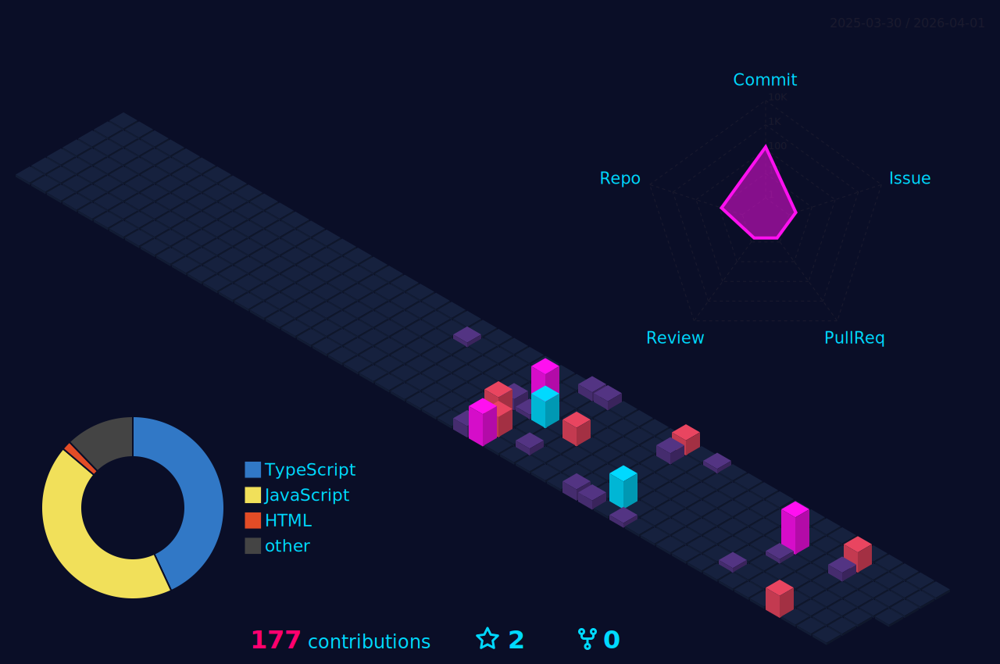
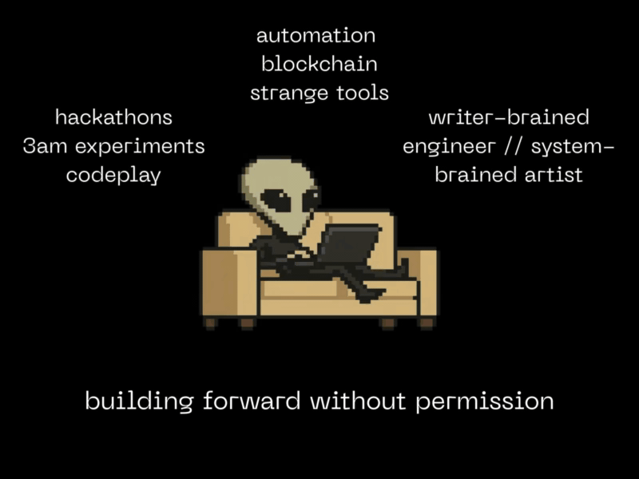

  

  <h3>building in public · shipping between categories · iterating openly</h3>

  

  <h3>log overview</h3>

  

  
ever since breaking the html on my myspace page, i've been chasing that same feeling — poke the system, see what bends, learn something, build again. most of what happens here starts as a question, a late-night experiment, or a tool i wish existed. sometimes it ships. sometimes it mutates. iteration is the point.

---

## 🚀 Featured Projects

---

## 📊 Recent Work

- [yahitscara](https://github.com/yahitscara/yahitscara) - Profile README
- [microstream](https://github.com/yahitscara/microstream) - Micropayments on Qubic blockchain
- [GhostPad](https://github.com/yahitscara/GhostPad) - Transparent writing app
- [LI_formatter](https://github.com/yahitscara/LI_formatter) - LinkedIn profile formatter
- [count_in_100s](https://github.com/yahitscara/count_in_100s) - Task tracker inspired by Alex Hormozi
